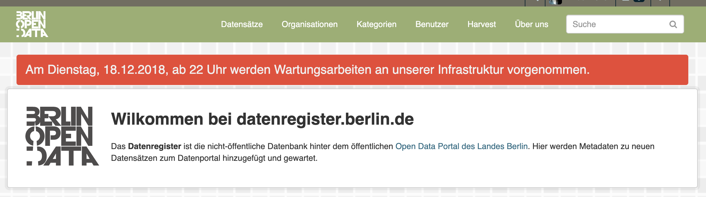

# ckanext-berlintheme

[](https://github.com/berlinonline/ckanext-berlintheme/actions)
[](http://codecov.io/github/berlinonline/ckanext-berlintheme?branch=master)

This plugin belongs to a set of plugins for the _Datenregister_ – the non-public [CKAN](https://ckan.org) instance that is part of Berlin's open data portal [daten.berlin.de](https://daten.berlin.de).
`ckanext-berlintheme` provides custom theming and UI for the Datenregister.

The plugin implements the following CKAN interfaces:

- [IBlueprint](http://docs.ckan.org/en/latest/extensions/plugin-interfaces.html#ckan.plugins.interfaces.IBlueprint)
- [IConfigurer](http://docs.ckan.org/en/latest/extensions/plugin-interfaces.html#ckan.plugins.interfaces.IConfigurer)
- [ITemplateHelpers](http://docs.ckan.org/en/latest/extensions/plugin-interfaces.html#ckan.plugins.interfaces.ITemplateHelpers)

## Requirements

This plugin has been tested with CKAN 2.9.5 (which requires Python 3).

## Custom Settings

### Global Warning Message

If `berlintheme.show_warning` is `true`, the content of `berlintheme.warning` will be displayed in a box in between the main navigation and the rest of the page.




```
berlintheme.show_warning = false
berlintheme.warning = Am Dienstag, 18.12.2018, ab 22 Uhr werden Wartungsarbeiten an unserer Infrastruktur vorgenommen.
```

## License

This material is copyright © [BerlinOnline Stadtportal GmbH & Co. KG](https://www.berlinonline.net/).

This extension is open and licensed under the GNU Affero General Public License (AGPL) v3.0.
Its full text may be found at:

http://www.fsf.org/licensing/licenses/agpl-3.0.html
