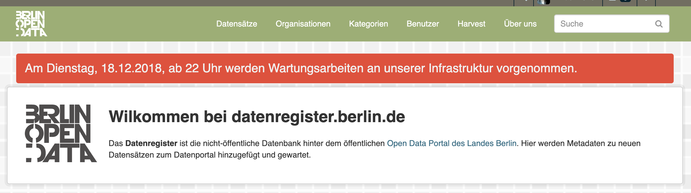

# ckanext-berlintheme

[](https://github.com/berlinonline/ckanext-berlintheme/actions)
[](http://codecov.io/github/berlinonline/ckanext-berlintheme?branch=master)

This plugin belongs to a set of plugins for the _Datenregister_ – the non-public [CKAN](https://ckan.org) instance that is part of Berlin's open data portal [daten.berlin.de](https://daten.berlin.de).
`ckanext-berlintheme` provides custom theming and UI for the Datenregister.

The plugin implements the following CKAN interfaces:

- [IActions](http://docs.ckan.org/en/latest/extensions/plugin-interfaces.html#ckan.plugins.interfaces.IActions)
- [IBlueprint](http://docs.ckan.org/en/latest/extensions/plugin-interfaces.html#ckan.plugins.interfaces.IBlueprint)
- [IConfigurer](http://docs.ckan.org/en/latest/extensions/plugin-interfaces.html#ckan.plugins.interfaces.IConfigurer)
- [ITemplateHelpers](http://docs.ckan.org/en/latest/extensions/plugin-interfaces.html#ckan.plugins.interfaces.ITemplateHelpers)

## Requirements

This plugin has been tested with CKAN 2.9.11 (which requires Python 3).

## Version Numbers for Plugins

The CKAN API's [status_show](https://docs.ckan.org/en/2.9/api/#ckan.logic.action.get.status_show) method includes a list of plugins as configured in the `ckan.plugins` setting.
`ckanext-berlintheme` includes an extended version of `status_show`  that also shows the version number of each plugin.
This assumes that the plugin module defines a `__version__` attribute that contains the version number.
If there is no `__version__` attribute, the version number will be `unknown`:

```json
{
  "help": "http://ckandev.bln/api/3/action/help_show?name=status_show",
  "success": true,
  "result": {
    "site_title": "Datenregister Dev",
    "site_description": "",
    "site_url": "http://ckandev.bln",
    "ckan_version": "2.9.11",
    "error_emails_to": null,
    "locale_default": "en",
    "extensions": {
      "stats": {
        "version": "unknown"
      },
      "berlintheme": {
        "version": "0.3.6"
      },
      "berlinauth": {
        "version": "0.2.6"
      }
    }
  }
}
```

## Custom Settings

### Global Warning Message

If `berlintheme.show_warning` is `true`, the content of `berlintheme.warning` will be displayed in a box in between the main navigation and the rest of the page.




```ini
berlintheme.show_warning = false
berlintheme.warning = Am Dienstag, 18.12.2018, ab 22 Uhr werden Wartungsarbeiten an unserer Infrastruktur vorgenommen.
```

## License

This material is copyright © [BerlinOnline GmbH](https://www.berlinonline.net/).

This extension is open and licensed under the GNU Affero General Public License (AGPL) v3.0.
Its full text may be found at:

http://www.fsf.org/licensing/licenses/agpl-3.0.html
